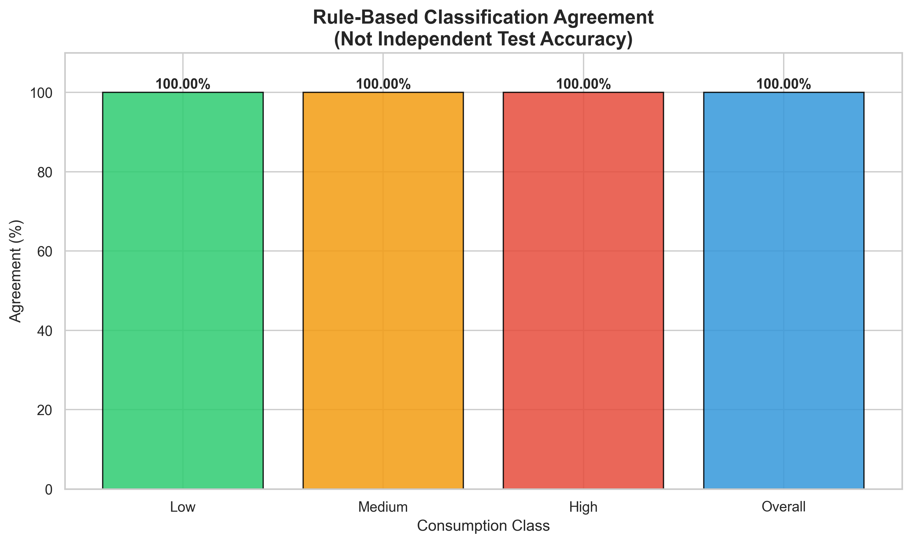
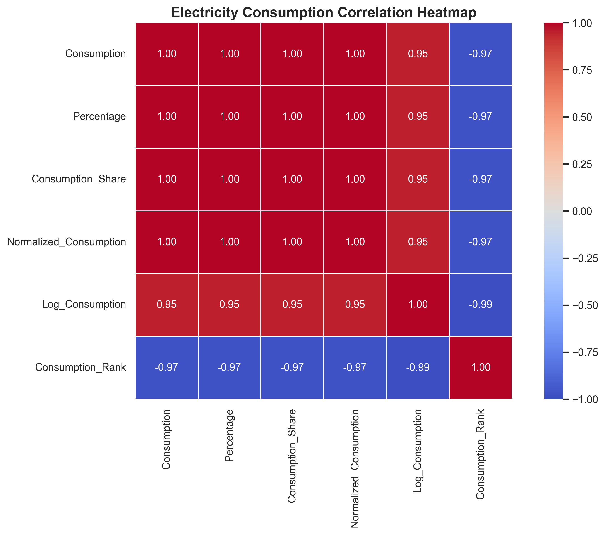
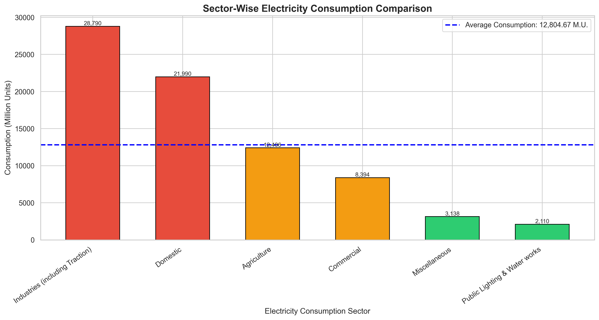
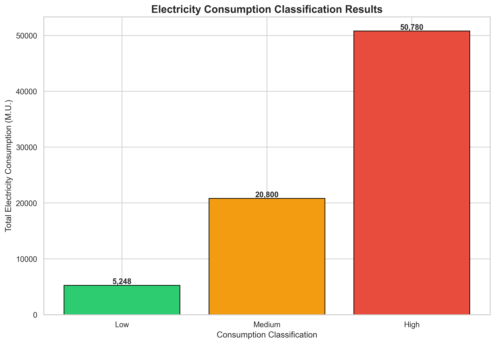
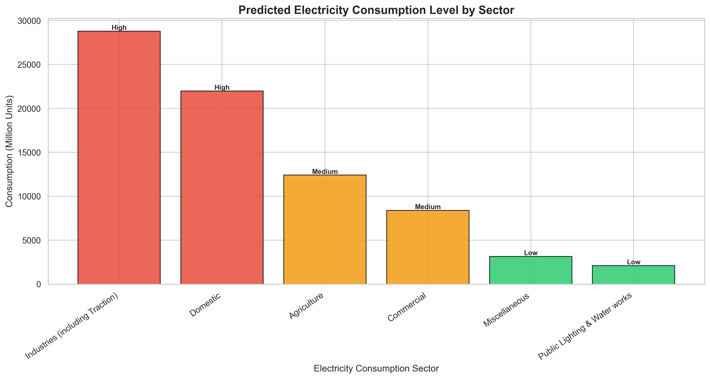
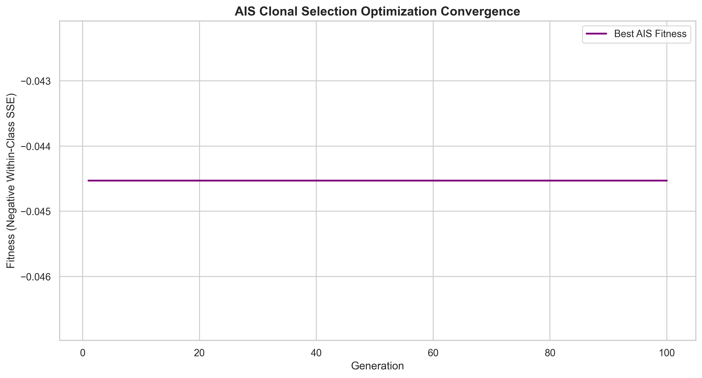
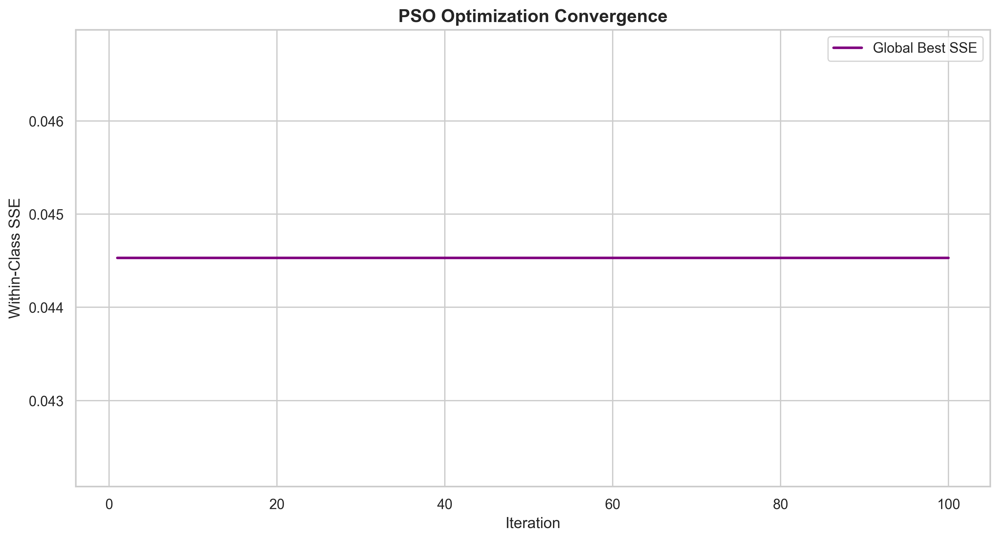
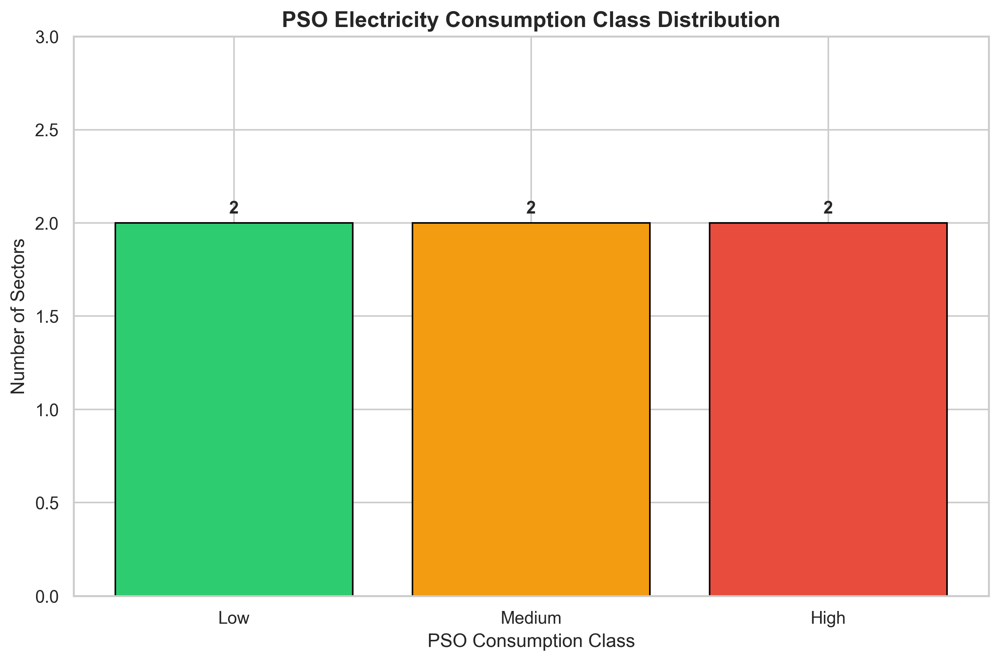

# AI-Based Electricity Consumption Pattern Analysis and Energy Demand Classification

## Project Overview

The **AI-Based Electricity Consumption Pattern Analysis and Energy Demand Classification** project analyzes sector-wise electricity consumption using data analytics, rule-based classification, Artificial Immune System (AIS), and Particle Swarm Optimization (PSO).

The project aims to identify electricity consumption patterns across different sectors and classify electricity usage into three categories:

- Low Consumption
- Medium Consumption
- High Consumption

The system analyzes electricity consumption data, generates classification results, optimizes classification thresholds, and produces graphical visualizations.

Three approaches are implemented:

1. **Baseline Rule-Based Classification**
2. **Artificial Immune System (AIS) Optimization**
3. **Particle Swarm Optimization (PSO)**

The project is developed using Python and libraries such as Pandas, NumPy, Matplotlib, Seaborn, Scikit-learn, H5py, and PyYAML.

---

## Project Objectives

The main objectives of this project are:

1. Analyze electricity consumption across different sectors.
2. Identify sectors with high, medium, and low electricity consumption.
3. Perform data preprocessing and feature engineering.
4. Implement a baseline rule-based classification system.
5. Apply AIS optimization to identify consumption classification thresholds.
6. Apply PSO optimization to identify consumption classification thresholds.
7. Compare electricity consumption patterns across sectors.
8. Generate classification results and prediction CSV files.
9. Visualize electricity consumption using graphs and heatmaps.
10. Save reusable models and results in multiple formats.

---

## Dataset Information

**Dataset Name:** Consumptionofelectricity_0.csv

The dataset contains electricity consumption information for different sectors.

### Dataset Features

| Feature | Description |
|---------|-------------|
| Category | Electricity consumption sector |
| Consumption(M.U.) | Electricity consumption in million units |
| Percentage of Consumption | Percentage contribution to total electricity consumption |

### Example Dataset

| Category | Consumption (M.U.) | Percentage |
|----------|-------------------:|-----------:|
| Industries | 28790 | 37.47 |
| Domestic | 21990 | 28.62 |
| Agriculture | 12406 | 16.15 |
| Commercial | 8394 | 10.93 |

The dataset contains seven sector-level records.

### Dataset Limitations

The dataset is small and does not contain independently labeled consumption classes or historical time-series observations.

Therefore:

- Classification categories are generated from consumption values.
- The baseline model uses percentile-based thresholds.
- AIS and PSO optimize thresholds using an unsupervised clustering objective.
- Predictions represent consumption-level assignments, not future demand forecasts.
- Rule agreement should not be interpreted as independent machine learning accuracy.

---

## Technologies Used

### Programming Language

- Python 3.10+

### Libraries

| Library | Purpose |
|---------|---------|
| Pandas | Data manipulation and analysis |
| NumPy | Numerical computations |
| Matplotlib | Data visualization |
| Seaborn | Statistical visualization |
| Scikit-learn | Data preprocessing and evaluation utilities |
| H5py | HDF5 model parameter storage |
| Pickle | Model serialization |
| PyYAML | Configuration storage |
| JSON | Structured results storage |

### Development Environment

- Jupyter Notebook
- Visual Studio Code
- Python

---

## Project Methodology

The project follows the workflow below:

```text
Electricity Consumption Dataset
              |
              v
       Data Preprocessing
              |
              v
       Feature Engineering
              |
              v
     Consumption Classification
              |
      +-------+-------+
      |       |       |
      v       v       v
   Baseline   AIS     PSO
      |       |       |
      v       v       v
 Threshold Optimization
              |
              v
    Consumption Level Assignment
              |
              v
      Result Generation
              |
              v
      Data Visualization
              |
              v
     Model and File Storage
```

---

## 1. Data Preprocessing

Data preprocessing prepares the electricity consumption dataset for analysis.

### Steps Performed

1. Load the CSV dataset.
2. Clean column names.
3. Convert consumption values into numerical format.
4. Remove invalid or missing records.
5. Remove aggregate total rows where applicable.
6. Combine duplicate sector categories.
7. Calculate total electricity consumption.
8. Normalize electricity consumption values.
9. Generate additional analytical features.

### Feature Engineering

The following features are generated:

- Consumption
- Percentage
- Consumption Share
- Normalized Consumption
- Log Consumption
- Consumption Rank

### Normalization Formula

Min-Max normalization is calculated as:

```text
X_normalized = (X - X_min) / (X_max - X_min)
```

This transforms electricity consumption values into the range [0, 1].

---

## 2. Baseline Electricity Consumption Classification

The baseline approach classifies electricity consumption into three categories using percentile-based thresholds.

### Classification Categories

| Class | Description |
|-------|-------------|
| Low | Lower consumption group |
| Medium | Intermediate consumption group |
| High | Higher consumption group |

### Classification Method

The first threshold is calculated using the 33.33rd percentile.

The second threshold is calculated using the 66.67th percentile.

```python
lower_threshold = df["Consumption"].quantile(1 / 3)

upper_threshold = df["Consumption"].quantile(2 / 3)
```

Classification rules:

```python
def classify_consumption(value):

    if value <= lower_threshold:
        return "Low"

    elif value <= upper_threshold:
        return "Medium"

    return "High"
```

These classes are relative to the observed dataset and are not official electricity demand standards.

---

## 3. Artificial Immune System (AIS)

### Introduction

Artificial Immune System (AIS) is a computational optimization technique inspired by biological immune systems.

AIS uses concepts such as:

- Antibodies
- Affinity evaluation
- Clonal selection
- Mutation
- Population diversity

This project implements a **Clonal Selection Algorithm (CLONALG-inspired)** to optimize electricity consumption classification thresholds.

### AIS Workflow

```text
Initialize Antibody Population
              |
              v
      Evaluate Fitness
              |
              v
    Select Best Antibodies
              |
              v
        Clone Antibodies
              |
              v
       Apply Mutation
              |
              v
     Evaluate New Solutions
              |
              v
    Update Best Antibody
              |
              v
      Repeat Generations
              |
              v
     Optimized Thresholds
              |
              v
 Electricity Consumption Classes
```

### AIS Configuration

| Parameter | Value |
|-----------|-------|
| Population Size | 40 |
| Generations | 100 |
| Clone Factor | 5 |
| Mutation Rate | 0.12 |
| Elite Count | 8 |
| Random State | 42 |

### AIS Fitness Function

AIS minimizes the within-class sum of squared errors.

```text
SSE = Sum over all clusters of
      Sum((x - cluster_mean)^2)
```

The fitness function is:

```text
Fitness = -SSE
```

Higher fitness values indicate lower within-class variation.

Solutions producing empty classes are penalized.

### AIS Output

The optimized antibody represents two thresholds:

```text
Antibody = [Threshold_1, Threshold_2]
```

These thresholds divide electricity consumption into Low, Medium, and High groups.

---

## 4. Particle Swarm Optimization (PSO)

### Introduction

Particle Swarm Optimization is a population-based optimization algorithm inspired by the collective behavior of birds and fish.

Each particle represents a possible solution.

Particles update their positions based on:

- Current velocity
- Personal best solution
- Global best solution

### PSO Workflow

```text
Initialize Particle Swarm
              |
              v
       Evaluate Fitness
              |
              v
      Update Personal Best
              |
              v
       Update Global Best
              |
              v
       Update Velocity
              |
              v
       Update Position
              |
              v
      Repeat Iterations
              |
              v
     Optimized Thresholds
              |
              v
 Electricity Consumption Classes
```

### PSO Configuration

| Parameter | Value |
|-----------|-------|
| Number of Particles | 40 |
| Maximum Iterations | 100 |
| Inertia Weight | 0.7 |
| Cognitive Coefficient | 1.5 |
| Social Coefficient | 1.5 |
| Random State | 42 |

### PSO Velocity Update

The velocity of each particle is updated using:

```text
v(t+1) = w*v(t)
       + c1*r1*(pbest - x(t))
       + c2*r2*(gbest - x(t))
```

Where:

- w = Inertia weight
- c1 = Cognitive coefficient
- c2 = Social coefficient
- r1, r2 = Random numbers
- pbest = Personal best position
- gbest = Global best position

### Position Update

```text
x(t+1) = x(t) + v(t+1)
```

### PSO Objective Function

The objective is to minimize within-class SSE.

```text
Objective = Minimize(SSE)
```

A lower SSE indicates more compact consumption groups.

---

## 5. Data Visualization

The project generates multiple visualizations to understand electricity consumption patterns and classification results.

### Classification Agreement Visualization



**Figure 1: Baseline Electricity Consumption Classification Agreement**

The graph displays agreement between the baseline rule-generated consumption labels and classifications produced using the same rules.

The graph includes:

- Low consumption agreement
- Medium consumption agreement
- High consumption agreement
- Overall agreement

**Important:** This graph is not an independent predictive accuracy measurement.

Because the baseline classifier uses the same thresholds that generated the reference labels, perfect rule agreement is expected.

### Correlation Heatmap



The heatmap displays relationships among numerical features such as consumption, percentage, normalized consumption, and consumption rank.

Several features are derived from consumption, so strong correlations are expected.

### Sector-Wise Consumption Comparison



This graph compares electricity consumption across sectors.

It helps identify:

- Highest electricity-consuming sectors
- Lowest electricity-consuming sectors
- Differences in sector-wise consumption
- Consumption relative to the dataset average

### Classification Result Visualization



The result graph displays total electricity consumption across Low, Medium, and High consumption categories.

### Prediction Visualization



The prediction graph displays the assigned consumption class for each existing sector.

These are classification predictions, not future electricity demand forecasts.

### AIS Optimization Visualization



This graph displays the best AIS fitness across generations.

It helps examine optimization convergence.

### AIS Class Distribution


This graph shows the number of electricity-consuming sectors assigned to each AIS class.

### PSO Optimization Visualization



This graph displays the best within-class SSE obtained during PSO iterations.

A decreasing SSE indicates improvement in the optimization objective.

### PSO Class Distribution



This graph shows the number of sectors assigned to each PSO classification group.

---

## 6. AIS vs PSO Comparison

Both AIS and PSO optimize electricity consumption classification thresholds.

| Parameter | AIS | PSO |
|-----------|-----|-----|
| Algorithm | Clonal Selection | Particle Swarm Optimization |
| Inspiration | Biological Immune System | Swarm Intelligence |
| Candidate Solution | Antibody | Particle |
| Search Mechanism | Cloning and Mutation | Velocity and Position Updates |
| Optimization Objective | Minimize SSE | Minimize SSE |
| Classification | Low, Medium, High | Low, Medium, High |
| Convergence Visualization | Fitness Graph | Fitness Graph |
| Model Storage | PKL and H5 | PKL and H5 |

### Comparison Criteria

The two algorithms can be compared using:

1. Best within-class SSE
2. Optimization convergence
3. Final classification thresholds
4. Distribution of sectors across classes
5. Stability across repeated random seeds
6. Computational execution time

Since both algorithms use the same objective function, their SSE values are directly comparable when calculated using the same normalized dataset.

Rule-agreement percentages should not be used to determine which optimization algorithm performs better.

---

## 7. Project Folder Structure

```text
AI-Based Electricity Consumption Pattern Analysis/
|
|-- Consumptionofelectricity_0.csv
|
|-- electricity_analysis.py
|-- ais_analysis.py
|-- pso_analysis.py
|
|-- electricity_consumption_model.pkl
|-- electricity_consumption_model.h5
|-- electricity_consumption_config.yaml
|-- electricity_consumption_results.json
|
|-- accuracy_graph.png
|-- heatmap.png
|-- comparison_graph.png
|-- result_graph.png
|-- prediction_graph.png
|-- confusion_matrix.png
|
|-- result.csv
|-- prediction.csv
|-- processed_electricity_consumption.csv
|
|-- ais_model.pkl
|-- ais_model.h5
|-- ais_config.yaml
|-- ais_results.json
|
|-- ais_accuracy_graph.png
|-- ais_heatmap.png
|-- ais_comparison_graph.png
|-- ais_result_graph.png
|-- ais_prediction_graph.png
|-- ais_confusion_matrix.png
|-- ais_fitness_graph.png
|-- ais_class_distribution_graph.png
|
|-- ais_result.csv
|-- ais_prediction.csv
|-- ais_processed_data.csv
|
|-- pso_model.pkl
|-- pso_model.h5
|-- pso_config.yaml
|-- pso_results.json
|
|-- pso_accuracy_graph.png
|-- pso_heatmap.png
|-- pso_comparison_graph.png
|-- pso_result_graph.png
|-- pso_prediction_graph.png
|-- pso_confusion_matrix.png
|-- pso_fitness_graph.png
|-- pso_class_distribution_graph.png
|
|-- pso_result.csv
|-- pso_prediction.csv
|-- pso_processed_data.csv
|
|-- README.md
```

The Python script filenames are suggested names for saving the three implementations.

---

## 8. Installation

### Step 1: Install Python

Install Python 3.10 or later.

Verify the installation:

```bash
python --version
```

### Step 2: Download the Project

Clone the repository:

```bash
git clone https://github.com/YOUR_USERNAME/YOUR_REPOSITORY.git
```

Navigate to the project directory:

```bash
cd YOUR_REPOSITORY
```

Alternatively, download the project as a ZIP file and extract it.

### Step 3: Install Dependencies

```bash
pip install pandas numpy matplotlib seaborn scikit-learn h5py pyyaml joblib
```

### Step 4: Configure Dataset Path

Update the dataset path in each Python script:

```python
BASE_DIR = (
    r"C:\Users\sagni\Downloads"
    r"\AI-Based Electricity Consumption Pattern Analysis"
)

DATASET_PATH = os.path.join(
    BASE_DIR,
    "Consumptionofelectricity_0.csv"
)
```

For other systems, change `BASE_DIR` to the appropriate project directory.

---

## 9. How to Run the Project

### Run Baseline Classification

```bash
python electricity_analysis.py
```

This generates baseline classification results and visualizations.

### Run AIS Optimization

```bash
python ais_analysis.py
```

This generates AIS-optimized classification results.

All AIS output filenames begin with:

```text
ais_
```

### Run PSO Optimization

```bash
python pso_analysis.py
```

This generates PSO-optimized classification results.

All PSO output filenames begin with:

```text
pso_
```

### Run in Jupyter Notebook

The project can also be executed in Jupyter Notebook.

1. Open Jupyter Notebook.
2. Create a new Python notebook.
3. Paste the desired implementation.
4. Configure the dataset path.
5. Execute the code.
6. View the displayed graphs.
7. Check the project directory for saved outputs.

---

## 10. Generated Output Files

### Baseline Classification Outputs

| File | Description |
|------|-------------|
| accuracy_graph.png | Rule-based classification agreement |
| heatmap.png | Correlation heatmap |
| comparison_graph.png | Sector-wise consumption comparison |
| result.csv | Classification results |
| result_graph.png | Classification result visualization |
| prediction.csv | Consumption class predictions |
| prediction_graph.png | Prediction visualization |
| confusion_matrix.png | Rule-agreement matrix |
| electricity_consumption_model.pkl | Saved classification pipeline |
| electricity_consumption_model.h5 | Model parameters and processed data |
| electricity_consumption_config.yaml | Configuration |
| electricity_consumption_results.json | Results summary |

### AIS Outputs

| File | Description |
|------|-------------|
| ais_accuracy_graph.png | AIS rule agreement |
| ais_heatmap.png | AIS correlation heatmap |
| ais_comparison_graph.png | AIS sector comparison |
| ais_result.csv | AIS classification results |
| ais_result_graph.png | AIS result visualization |
| ais_prediction.csv | AIS class predictions |
| ais_prediction_graph.png | AIS prediction visualization |
| ais_confusion_matrix.png | AIS rule-agreement matrix |
| ais_fitness_graph.png | AIS optimization convergence |
| ais_class_distribution_graph.png | AIS class distribution |
| ais_model.pkl | Saved AIS model |
| ais_model.h5 | AIS parameters |
| ais_config.yaml | AIS configuration |
| ais_results.json | AIS results summary |

### PSO Outputs

| File | Description |
|------|-------------|
| pso_accuracy_graph.png | PSO rule agreement |
| pso_heatmap.png | PSO correlation heatmap |
| pso_comparison_graph.png | PSO sector comparison |
| pso_result.csv | PSO classification results |
| pso_result_graph.png | PSO result visualization |
| pso_prediction.csv | PSO class predictions |
| pso_prediction_graph.png | PSO prediction visualization |
| pso_confusion_matrix.png | PSO rule-agreement matrix |
| pso_fitness_graph.png | PSO optimization convergence |
| pso_class_distribution_graph.png | PSO class distribution |
| pso_model.pkl | Saved PSO model |
| pso_model.h5 | PSO parameters |
| pso_config.yaml | PSO configuration |
| pso_results.json | PSO results summary |

---

## 11. Model Storage Formats

The project stores model parameters and analysis results in four formats.

### PKL Format

The `.pkl` files store reusable classification pipelines or model parameter dictionaries.

Example:

```python
import pickle

with open("pso_model.pkl", "rb") as file:
    model = pickle.load(file)

print(model)
```

Only load pickle files from trusted sources.

### H5 Format

The `.h5` files store numerical model parameters, thresholds, and processed data using HDF5.

These are not trained neural network weight files.

### YAML Format

The `.yaml` files store:

- Project configuration
- Algorithm hyperparameters
- Classification thresholds
- Optimization settings
- Evaluation information

### JSON Format

The `.json` files store:

- Project metadata
- Sector-level classification results
- Consumption statistics
- Optimized thresholds
- Optimization results
- Class distribution

---

## 12. Expected Results

The project is designed to produce the following analytical outcomes.

### Electricity Consumption Analysis

- Identification of high-consumption sectors
- Identification of low-consumption sectors
- Sector-wise electricity consumption percentages
- Relative consumption rankings

### Classification

- Baseline Low, Medium, and High consumption classes
- AIS-optimized classification thresholds
- PSO-optimized classification thresholds
- Sector-level class assignments

### Optimization

- AIS fitness convergence
- PSO SSE convergence
- Comparison of optimized classification boundaries
- Comparison of final within-class variation

### Visualization

- Classification agreement graphs
- Correlation heatmaps
- Consumption comparison graphs
- Result graphs
- Prediction graphs
- Class distribution graphs
- Optimization convergence graphs

Actual optimization results depend on the dataset and algorithm execution.

---

## 13. Applications

### Energy Resource Planning

The analysis can help identify sectors that account for larger shares of electricity consumption.

### Sector-Wise Consumption Monitoring

Electricity consumption patterns can be compared across domestic, industrial, agricultural, commercial, and other sectors.

### Energy Policy Analysis

The classification results can provide descriptive evidence for studying electricity consumption distribution.

### Electricity Demand Research

The project can serve as a starting point for larger electricity demand forecasting studies.

### Optimization Research

AIS and PSO can be studied as alternative methods for finding classification thresholds.

---

## 14. Advantages

1. Simple and understandable classification framework.
2. Supports baseline, AIS, and PSO approaches.
3. Automated data preprocessing.
4. Generates multiple analytical visualizations.
5. Exports results in CSV and JSON formats.
6. Saves model parameters in PKL and H5 formats.
7. Supports reproducible optimization experiments.
8. Can be extended to larger electricity consumption datasets.

---

## 15. Limitations

The current implementation has several limitations.

### Small Dataset

The dataset contains only seven sector-level records, limiting the reliability of statistical conclusions.

### No Independent Target Labels

Consumption categories are generated from observed electricity consumption rather than external ground-truth labels.

### No Independent Accuracy Evaluation

The classification agreement graphs do not represent supervised model accuracy.

### No Future Demand Forecasting

The dataset does not contain sufficient time-series information to forecast future electricity consumption.

### Single Primary Input Feature

The optimization models use electricity consumption as the primary feature.

### Optimization Sensitivity

AIS and PSO may produce different thresholds depending on initialization and optimization settings.

---

## 16. Future Enhancements

The project can be extended through:

1. Collecting electricity consumption data across multiple years.
2. Adding district-wise and state-wise electricity consumption.
3. Incorporating weather, population, and economic indicators.
4. Implementing Random Forest and Gradient Boosting models.
5. Developing LSTM-based electricity demand forecasting.
6. Implementing hybrid AIS-PSO optimization.
7. Comparing clustering methods using silhouette scores.
8. Adding cross-validation when suitable labeled data becomes available.
9. Developing an interactive Streamlit dashboard.
10. Integrating real-time electricity consumption data.

---

## 17. Conclusion

The **AI-Based Electricity Consumption Pattern Analysis and Energy Demand Classification** project demonstrates how data analytics and nature-inspired optimization algorithms can be used to study electricity consumption patterns.

The baseline approach provides percentile-based classification, while AIS and PSO optimize the thresholds used to form consumption groups.

The project generates sector-level classifications, graphical visualizations, optimization convergence plots, and reusable model artifacts.

Although the current dataset is too small for reliable supervised machine learning evaluation, the project provides a foundation for future electricity demand analysis and optimization research.

---

## 18. Keywords

Artificial Intelligence, Electricity Consumption, Energy Demand Classification, Machine Learning, Artificial Immune System, AIS, Clonal Selection Algorithm, Particle Swarm Optimization, PSO, Data Analytics, Energy Management, Electricity Consumption Pattern Analysis, Python, Optimization Algorithms, Data Visualization.

---

## 19. License

This project is intended for educational, academic, and research purposes.

The dataset and any third-party resources remain subject to their respective licenses.

---

## 20. Acknowledgements

This project uses open-source Python libraries for data processing, optimization, visualization, and model storage.

The implementations of Artificial Immune System and Particle Swarm Optimization are intended to demonstrate nature-inspired optimization techniques for electricity consumption classification.
